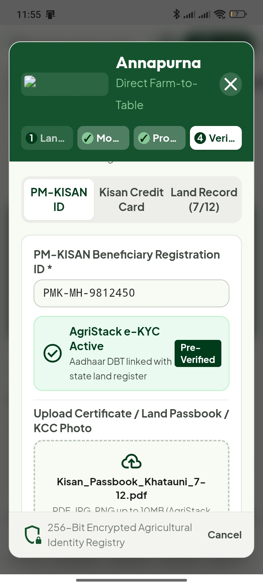
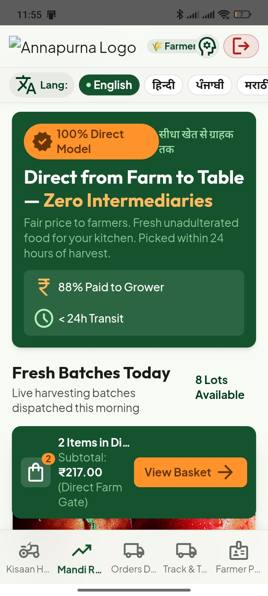
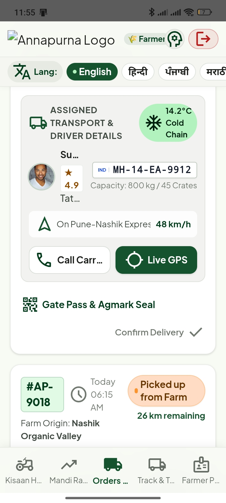

<<<<<<< HEAD

# Annapurna - Direct Farm-to-Consumer & Rural Intelligence Platform
### Smart India Hackathon (SIH) Project

 

*Eliminating intermediaries to ensure fair earnings for farmers and transparent, affordable prices for consumers, anchored by a rigorous farmer identity verification protocol.*

---

## Core Feature: Farmer Verification System

To maintain absolute marketplace integrity and ensure that only genuine agricultural workers list produce directly, Annapurna implements a strict **Farmer Identity Verification Protocol**:

* **Credential Authentication:** During the registration and onboarding wizard, farmers must provide official government or institutional proof of agricultural status before gaining access to the selling tools and Kisaan Hub.
* **Accepted Verification Documents:**
  * **PM-KISAN Beneficiary Registration ID / Status**
  * **Kisan Credit Card (KCC) Details**
  * **State-Issued Land Ownership Records / Land Passbooks (Khatauni / Khasra)**
* **Verification Status Workflow:** Profiles are tagged with dynamic status badges ("Pending Verification" vs. "Verified Farmer"), safeguarding consumers against fraudulent listings and assuring fair direct-to-consumer trade.
* **Step-by-Step Security Lock:** Onboarding enforces a strict linear progression. Users cannot advance past the verification and identity steps without completing required fields, preventing bypass attempts.

---

## Additional Key Features

* **Multilingual Regional Support:** Complete interface localization in English (Default), Hindi, Punjabi, Marathi, and Telugu with locked user preferences post-login.
* **Custom Transport & Live Tracking:** Consumers can choose specific delivery vehicles (2-Wheeler, 3-Wheeler, Tempo, Truck) based on order volume, tracking vehicle plate numbers and live driver details.
* **Distance-Based Minimum Order Rules:** Automatically enforces quantity rules (e.g., minimum 15 kg for distances > 10 km) to optimize logistics efficiency.
* **Dual Mode (Online & Offline) with Local RAG:** 
  * *Online Mode:* Full marketplace functionality, live transport selection, and cloud-backed AI assistance.
  * *Offline Mode:* Instant fallback displaying cached market prices and local vector-search RAG knowledge base for agricultural advisory without cellular connectivity.
* **Kisaan AI Sahayak:** RAG-powered smart assistant providing trending agricultural questions, weather forecasts, and regional logistics guidance across supported languages.

---

## Tech Stack

* **Frontend:** Responsive Mobile-First UI, HTML5, CSS3, JavaScript / React
* **AI & Intelligence:** Google AI Studio, Gemini API, RAG (Retrieval-Augmented Generation)
* **Architecture:** Local-first storage, offline fallback caching, background sync routing

---
## App Preview & Screenshots

   &nbsp;&nbsp;
   &nbsp;&nbsp;
  
  

## Run Locally

Follow these steps to run the application locally on your machine:

**Prerequisites:** Ensure you have Node.js installed.

=======
# Annapurna
Annapurna is a comprehensive, mobile-first agricultural platform built for the Smart India Hackathon (SIH) to address the core problem of agricultural market inefficiencies: how multiple intermediaries reduce farmers' earnings while artificially driving up consumer prices.
>>>>>>> dfd7e3135d6399e21607a7b1587730a25718f7b9
